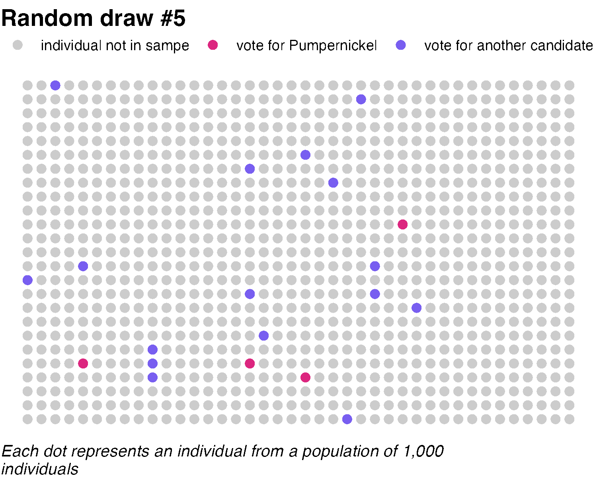
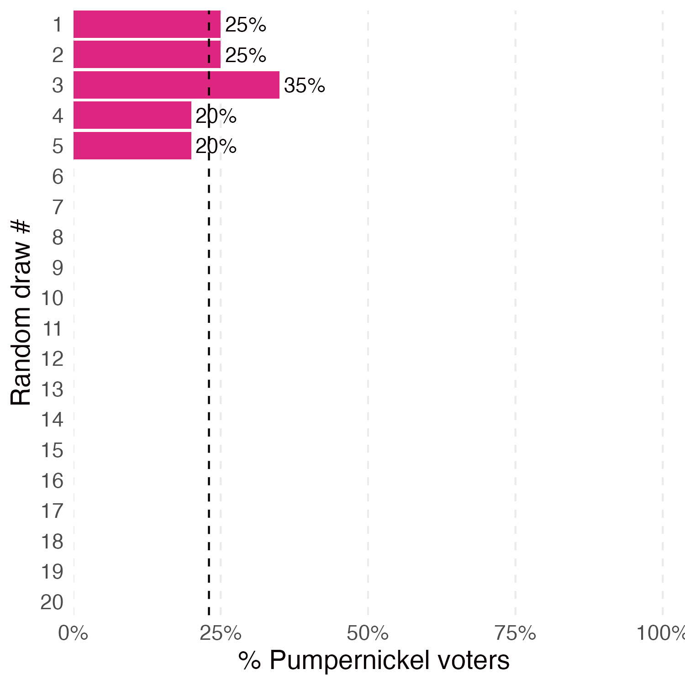
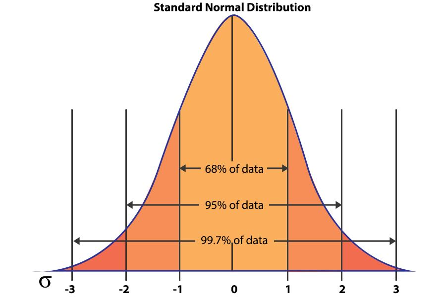
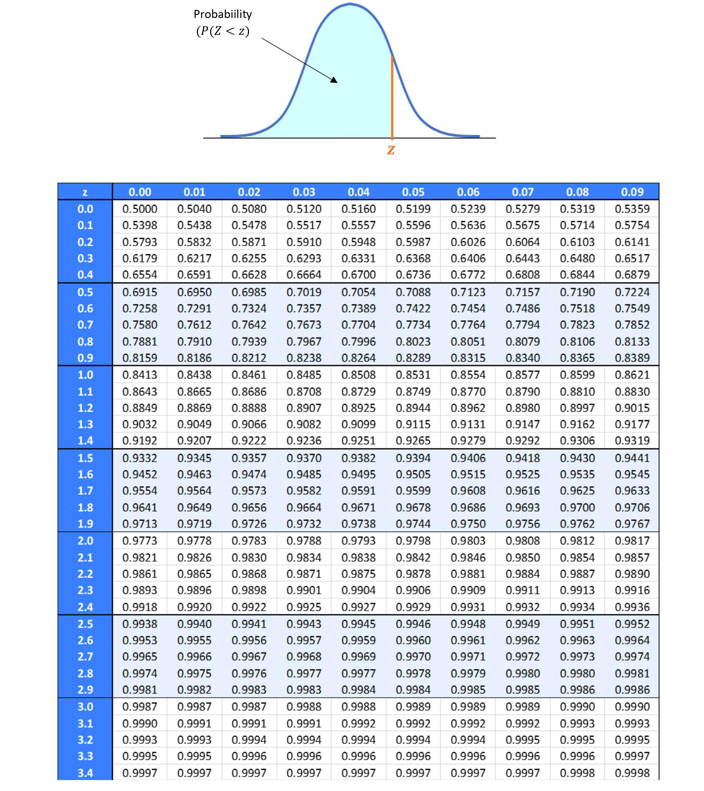

```{r}
#| echo: false
#| output: false
#| cache: false


source("../assets/r/common_loading.R")
```

## Recap quiz


Or click here: [link to Wooclap](https://app.wooclap.com/L2STATSUM?from=instruction-slide)

## Today's lecture

<p style = "margin-bottom: 1cm;"></p>

[**1. Sampling: an example**](#sampling)

<p style = "margin-bottom: .5cm;"></p>

[2. Statistical inference](#inference)

<p style = "margin-bottom: .5cm;"></p>

[3. Quantifying uncertainty](#uncertainty)

# Sampling: an example {.slide_inverse #sampling}

## Political polling {.pause}

Imagine you are the campaign manager of a new political candidate: [Pumpernickel]{.hi_cranberry}. She wants to know the share of the population who will vote for her. How would you proceed?

. . .

1. *Ask every single voter in the country who they intend to vote for?*

. . .

$\rightarrow$ <u>Too costly:</u> only **survey** a fraction or **sample** of the population.

. . .

2. *What characteristics of the sample?*

. . .

$\rightarrow$ How **many** people do you survey? How would you select them?

. . .
  
3. *Once you've conducted your survey, would you get the exact share of voters?*

. . .

$\rightarrow$ <u>Probably not:</u> you obtain an **estimate** of this share.

## Population vs. sample

::: {.callout-important}
## Definitions

::: {.incremental}

- **Population:** the entire group about which we want information, denoted $N$.

- **Sample:** the fraction of the population for which we collect information, denoted $n$.

- **Sampling rate:** ratio between the sample size and the population size, denoted $t = n/N$.

- **Sampling error:** the error incurred when the statistical characteristics of a population are estimated from a sample of that population.

:::
:::

. . .

[Goal:]{.hi_purple} use information from the sample to draw conclusions about the population as a whole. In order to ensure *accurate* inferences about the population, the sample needs to be **representative** of the population.

## Sampling

When it is **costly** to collect information on the whole population, and you want to know some characteristics of a population, you only [survey a sample of individuals]{.hi_purple}.

. . .

Two main challenges:

1. **Selecting** the sample

2. Measuring the **level of uncertainty** on the statistics you get

## Selection and sampling {.pause}

**How to ensure your sample is representative ?**

. . .

* For you, the easiest way of surveying people could be to do so at the [Cergy RER A]{.hi_blue} station and ask people as they exit the station.

$\rightarrow$ Does it sound like a good idea? Why?

. . .
  
* Very likely that this is a **biased** sample, in the sense that it is not representative of the **population of interest** (French voters)

. . .
  
* The best way of making a representative sample of the population of interest is to [randomly select]{.hi_purple} the individuals who are included in the sample

  – You can do so if you have access to the exhaustive list of individuals in the population of interest: the **sample frame**
  
  – Having access to the exhaustive list of observations of a population is most of the time difficult
  
## Random sample

::: {.callout-important .incremental}
## Definition

The random variables $X_1, ..., X_n$ are called a **random sample of size n from a population** if $X_1, ..., X_n$ are mutually independent random variables and each $X_i$ has the same probability distribution. Alternatively, $X_1, ..., X_n$ are called *independent and identically distributed random variables.* This is commonly abbreviated to i.i.d. random variables.
:::
  
## Random sampling

Let's imagine the population of interest is 1,000 individuals.

:::: {.columns .fragment}
::: {.column width="50%"}


```{r}
#| echo: false
#| fig-width: 5
#| fig-height: 4

set.seed(123)

# Parameters
n_pop <- 1000
n_cols <- 40
sample_size <- 20
prop_candidate <- 0.23

# create population
population <- expand.grid(x = 1:n_cols,
                          y = 1:(n_pop/n_cols)) |> 
  mutate(id = row_number(),
         vote_candidate = id %in% sample(id, prop_candidate*n_pop))

# Function to create one sample
create_sample <- function(sample_id) {
  population |> 
    mutate(id = row_number(),
           sampled = id %in% sample(1:n_pop, sample_size),
           sampled_vote_candidate = case_when(sampled == T & vote_candidate == T ~ "candidate",
                                              sampled == T & vote_candidate == F ~ "other candidate",
                                              sampled == F ~ "not sampled"),
           sampled_vote_candidate = fct_relevel(sampled_vote_candidate, "not sampled", "candidate", "other candidate"),
           sample_id = sample_id)
}

# Map over 20 samples
samples_df <- map_df(1:20, create_sample)

# Plot
samples_df |>
  filter(sample_id == 1) |>
  mutate(show = "individual in population of interest") |> 
  ggplot(aes(x = x, y = y)) +
  geom_point(aes(color = show), size = 2.5, shape = 16) +
  scale_color_manual(values = c("individual in population of interest" = "black")) +
  labs(color = NULL) +
  coord_equal() +
  theme_void() +
  theme(legend.position = "top",
        plot.title = element_text(size = 14, hjust = 0, face = "bold"),
        plot.caption = element_text(size = 10, hjust = 0, face = "italic"),
        plot.margin = unit(c(0,0,0,0), "lines")) +
  labs(title = "Population of interest",
       caption = str_wrap("Each dot represents an individual from a population of 1,000 individuals", 70))
```

:::

::: {.column width="50%" .fragment}

We make some simplifying assumptions:

* individuals truthfully report their [voting intentions]{.hi_purple}

* their current preferences correspond to their preferences on election day

:::
:::

## Random sampling

Let's imagine the population of interest is 1,000 individuals.

:::: {.columns}
::: {.column width="50%"}


```{r}
#| echo: false
#| fig-width: 5
#| fig-height: 4

# Plot
population |>
  mutate(vote_candidate = factor(vote_candidate)) |> 
  ggplot(aes(x = x, y = y)) +
  geom_point(aes(color = fct_rev(vote_candidate)), size = 2.5, shape = 16) +
  scale_color_manual(values = c("FALSE" = "#785EF0", "TRUE" = "#DC267F"),
                     labels = c("vote for Pumpernickel", "vote for another candidate")) +
  labs(color = NULL) +
  coord_equal() +
  theme_void() +
  theme(legend.position = "top",
        plot.title = element_text(size = 14, hjust = 0, face = "bold"),
        plot.caption = element_text(size = 10, hjust = 0, face = "italic"),
        plot.margin = unit(c(0,0,0,0), "lines")) +
  labs(title = "Population of interest",
       caption = str_wrap("Each dot represents an individual from a population of 1,000 individuals", 70))
```

:::

::: {.column width="50%"}

We make some simplifying assumptions:

* individuals truthfully report their [voting intentions]{.hi_purple}

* their current preferences correspond to their preferences on election day

* we know that Pumpernickel's vote share is 23%

  – 0.23 is the [true population proportion]{.hi_purple} (denoted $p$)

:::
:::

## Random sampling

Let's imagine the population of interest is 1,000 individuals.

:::: {.columns}
::: {.column width="50%"}


```{r}
#| echo: false
#| fig-width: 5
#| fig-height: 4

# Plot
samples_df |>
  filter(sample_id == 1) |>
  mutate(show = "individual in population of interest") |> 
  ggplot(aes(x = x, y = y)) +
  geom_point(aes(color = show), size = 2.5, shape = 16) +
  scale_color_manual(values = c("individual in population of interest" = "black")) +
  labs(color = NULL) +
  coord_equal() +
  theme_void() +
  theme(legend.position = "top",
        plot.title = element_text(size = 14, hjust = 0, face = "bold"),
        plot.caption = element_text(size = 10, hjust = 0, face = "italic"),
        plot.margin = unit(c(0,0,0,0), "lines")) +
  labs(title = "Population of interest",
       caption = str_wrap("Each dot represents an individual from a population of 1,000 individuals", 70))
```

:::

::: {.column width="50%"}

* In pratice, you do not know the true population parameter.

* Let's survey 20 individuals

* We ensure they are selected at [random]{.hi_blue}

:::
:::

## Random sampling

Let's imagine the population of interest is 1,000 individuals.

:::: {.columns}
::: {.column width="50%"}


```{r}
#| echo: false
#| fig-width: 5
#| fig-height: 4

samples_df |>
  filter(sample_id == 1) |>
  ggplot(aes(x = x, y = y)) +
  geom_point(aes(color = sampled), size = 2.5, shape = 16) +
  scale_color_manual(values = c("FALSE" = "#cccccc", "TRUE" = "#648FFF"),
                     labels = c("individual not in sample",
                                "individual in sample")) +
  coord_equal() +
  theme_void() +
  theme(legend.position = "top",
        legend.title = element_blank(),
        plot.title = element_text(size = 14, hjust = 0, face = "bold"),
        plot.caption = element_text(size = 10, hjust = 0, face = "italic"),
        plot.margin = unit(c(0,0,0,0), "lines")) +
  labs(title = "Random draw #1",
       caption = str_wrap("Each dot represents an individual from a population of 1,000 individuals", 70))
```

:::

::: {.column width="50%"}

* In pratice, you do not know the true population parameter.

* Let's survey 20 individuals

* We ensure they are selected at [random]{.hi_blue}

:::
:::

## Random sampling

Let's imagine the population of interest is 1,000 individuals.

:::: {.columns}
::: {.column width="50%"}


```{r}
#| echo: false
#| fig-width: 5
#| fig-height: 4

samples_df |>
  filter(sample_id == 1) |>
  ggplot(aes(x = x, y = y)) +
  geom_point(aes(color = sampled), size = 2.5, shape = 16) +
  scale_color_manual(values = c("FALSE" = "#cccccc", "TRUE" = "#648FFF"),
                     labels = c("individual not in sample",
                                "individual in sample")) +
  coord_equal() +
  theme_void() +
  theme(legend.position = "top",
        legend.title = element_blank(),
        plot.title = element_text(size = 14, hjust = 0, face = "bold"),
        plot.caption = element_text(size = 10, hjust = 0, face = "italic"),
        plot.margin = unit(c(0,0,0,0), "lines")) +
  labs(title = "Random draw #1",
       caption = str_wrap("Each dot represents an individual from a population of 1,000 individuals", 70))
```

:::

::: {.column width="50%"}

* In pratice, you do not know the true population parameter.

* Let's survey 20 individuals

* We ensure they are selected at [random]{.hi_blue}

* How many report they will vote for [Pumpernickel]{.hi_cranberry}?

:::
:::


## Random sampling

Let's imagine the population of interest is 1,000 individuals.

:::: {.columns}
::: {.column width="50%"}


```{r}
#| echo: false
#| fig-width: 5
#| fig-height: 4


samples_df |>
  filter(sample_id == 1) |> 
  ggplot(aes(x = x, y = y)) +
  geom_point(aes(color = sampled_vote_candidate), size = 2.5, shape = 16) +
  scale_color_manual(values = c("not sampled" = "#cccccc", "other candidate" = "#785EF0", "candidate" = "#DC267F"),
                     labels = c("individual not in sampe", "vote for Pumpernickel", "vote for another candidate")) +
  coord_equal() +
  theme_void() +
  theme(legend.position = "top",
        legend.title = element_blank(),
        plot.title = element_text(size = 14, hjust = 0, face = "bold"),
        plot.caption = element_text(size = 10, hjust = 0, face = "italic"),
        plot.margin = unit(c(0,0,0,0), "lines")) +
  labs(title = "Random draw #1",
       caption = str_wrap("Each dot represents an individual from a population of 1,000 individuals", 70))
```

:::

::: {.column width="50%"}

* In pratice, you do not know the true population parameter.

* Let's survey 20 individuals

* We ensure they are selected at [random]{.hi_blue}

* How many report they will vote for [Pumpernickel]{.hi_cranberry}?

:::
:::

. . .

5 will vote for [Pumpernickel]{.hi_cranberry} out of [20]{.hi_blue} = 25%

0.25 can be thought of as our guess of the vote share for [Pumpernickel]{.hi_cranberry}

## Parameters and statistics {.pause}

* We denote our *guess* of the vote share for Pumpernickel $\hat{p}$.

. . .

* The $\hat{\text{ }}$ denotes that this [statistic]{.hi_purple} has been [estimated]{.hi_blue}.

. . .

* It corresponds to the [estimate]{.hi_yellow} of the population parameter $p$, which is the true vote share for Pumpernickel.

. . .

<!-- ## Greek letters and statistics -->

<!-- :::: {.columns} -->
<!-- ::: {.column width="50%"} -->

<!-- Latin Letters -->

<!-- * Latin letters like $\bar{x}$ and $s^2$ are calculations that represent guesses (estimates) at the population values. -->

<!-- ::: -->

<!-- ::: {.column width="50%"} -->

<!-- Greek letters -->

<!-- * Greek letters like $\mu$ and $\sigma^2$ represent the truth about the population. -->

<!-- ::: -->
<!-- :::: -->

The goal for the class is for the estimates to be good guesses for the population parameters:

$$
\text{Data} \rightarrow \text{Calculation} \rightarrow \hat{\text{Estimates}} \xrightarrow{\text{hopefully!}} \text{Truth}
$$

. . .

For example,

$$
X \rightarrow \frac{1}{n}\sum_{i=1}^{n}X_i \rightarrow \bar{x} \xrightarrow{\text{hopefully!}} \mu
$$

## Sampling variation

- What would happen if we took a new sample? Would we also get 5 [Pumpernickel]{.hi_cranberry} voters as before?

- What if we repeated this survey multiple times?

. . .

- Probably not. The samples will vary from draw to draw.

- Key to this observation: these are [randomly drawn samples]{.hi_purple}.


## Sampling variation 

:::: {.columns}
::: {.column width="50%"}


```{r}
#| echo: false
#| fig-width: 5
#| fig-height: 4


samples_df |> 
  filter(sample_id == 1) |> 
  ggplot(aes(x = x, y = y)) +
  geom_point(aes(color = sampled_vote_candidate), size = 2.5, shape = 16) +
  scale_color_manual(values = c("not sampled" = "#cccccc", "other candidate" = "#785EF0", "candidate" = "#DC267F"),
                     labels = c("individual not in sampe", "vote for Pumpernickel", "vote for another candidate")) +
  coord_equal() +
  theme_void() +
  theme(legend.position = "top",
        legend.title = element_blank(),
        plot.title = element_text(size = 14, hjust = 0, face = "bold"),
        plot.caption = element_text(size = 10, hjust = 0, face = "italic"),
        plot.margin = unit(c(0,0,0,0), "lines")) +
  labs(title = "Random draw #1",
       caption = str_wrap("Each dot represents an individual from a population of 1,000 individuals", 70))
```

:::

::: {.column width="50%"}

```{r}
#| echo: false
#| fig-width: 5


samples_df |> 
  filter(sampled == T) |> 
  summarise(prop = mean(sampled_vote_candidate == "candidate"), .by = sample_id) |> 
  mutate(sample_id = factor(sample_id),
         show = (sample_id == 0)) |> 
  ggplot(aes(y = fct_rev(sample_id),
             x = prop,
             fill = show)) +
  geom_bar(stat = "identity") +
  geom_vline(xintercept = .23, linetype = 2) +
  geom_richtext(aes(x = .25, y = 20, label = "*true vote share = 23%*"), angle = -90, label.color = NA, hjust = 0, color = "grey40") +
  scale_x_continuous(lim = c(0, 1), expand = expansion(mult = c(0,0.02)), labels = scales::percent) +
  scale_y_discrete(expand = c(0,0)) +
  scale_fill_manual(values = c("TRUE" = "#DC267F", "FALSE" = "transparent")) +
  labs(x = "% Pumpernickel voters",
       y = "Random draw #") +
  theme_minimal() +
  theme(panel.grid.major.y = element_blank(),
        panel.grid.minor.x = element_blank(),
        panel.grid.major.x = element_line(linetype = 2),
        legend.position = "none",
        text = element_text(size = 14))
```

:::
:::


## Sampling variation 

:::: {.columns}
::: {.column width="50%"}


```{r}
#| echo: false
#| fig-width: 5
#| fig-height: 4

samples_df |> 
  filter(sample_id == 1) |> 
  ggplot(aes(x = x, y = y)) +
  geom_point(aes(color = sampled_vote_candidate), size = 2.5, shape = 16) +
  scale_color_manual(values = c("not sampled" = "#cccccc", "other candidate" = "#785EF0", "candidate" = "#DC267F"),
                     labels = c("individual not in sampe", "vote for Pumpernickel", "vote for another candidate")) +
  coord_equal() +
  theme_void() +
  theme(legend.position = "top",
        legend.title = element_blank(),
        plot.title = element_text(size = 14, hjust = 0, face = "bold"),
        plot.caption = element_text(size = 10, hjust = 0, face = "italic"),
        plot.margin = unit(c(0,0,0,0), "lines")) +
  labs(title = "Random draw #1",
       caption = str_wrap("Each dot represents an individual from a population of 1,000 individuals", 70))
```

:::

::: {.column width="50%"}

```{r}
#| echo: false
#| fig-width: 5

samples_df |> 
  filter(sampled == T) |> 
  summarise(prop = mean(sampled_vote_candidate == "candidate"), .by = sample_id) |> 
  mutate(sample_id = factor(sample_id),
         show = (sample_id == 1)) |> 
  ggplot(aes(y = fct_rev(sample_id),
             x = prop,
             fill = show)) +
  geom_bar(stat = "identity") +
  geom_vline(xintercept = .23, linetype = 2) +
  geom_text(aes(label = ifelse(sample_id == 1, scales::percent(prop), "")), hjust = -0.1) +
  scale_x_continuous(lim = c(0, 1), expand = expansion(mult = c(0,0.02)), labels = scales::percent) +
  scale_y_discrete(expand = c(0,0)) +
  scale_fill_manual(values = c("TRUE" = "#DC267F", "FALSE" = "transparent")) +
  labs(x = "% Pumpernickel voters",
       y = "Random draw #") +
  theme_minimal() +
  theme(panel.grid.major.y = element_blank(),
        panel.grid.minor.x = element_blank(),
        panel.grid.major.x = element_line(linetype = 2),
        legend.position = "none",
        text = element_text(size = 14))
```

:::
:::

## Sampling variation 

:::: {.columns}
::: {.column width="50%"}


```{r}
#| echo: false
#| fig-width: 5
#| fig-height: 4


num_show = 2

samples_df |> 
  filter(sample_id == num_show) |> 
  ggplot(aes(x = x, y = y)) +
  geom_point(aes(color = sampled_vote_candidate), size = 2.5, shape = 16) +
  scale_color_manual(values = c("not sampled" = "#cccccc", "other candidate" = "#785EF0", "candidate" = "#DC267F"),
                     labels = c("individual not in sampe", "vote for Pumpernickel", "vote for another candidate")) +
  coord_equal() +
  theme_void() +
  theme(legend.position = "top",
        legend.title = element_blank(),
        plot.title = element_text(size = 14, hjust = 0, face = "bold"),
        plot.caption = element_text(size = 10, hjust = 0, face = "italic"),
        plot.margin = unit(c(0,0,0,0), "lines")) +
  labs(title = glue("Random draw #{num_show}"),
       caption = str_wrap("Each dot represents an individual from a population of 1,000 individuals", 70))
```

:::

::: {.column width="50%"}

```{r}
#| echo: false
#| fig-width: 5

samples_df |> 
  filter(sampled == T) |> 
  summarise(prop = mean(sampled_vote_candidate == "candidate"), .by = sample_id) |> 
  mutate(sample_id = factor(sample_id),
         show = (sample_id %in% 1:num_show)) |> 
  ggplot(aes(y = fct_rev(sample_id),
             x = prop,
             fill = show)) +
  geom_bar(stat = "identity") +
  geom_vline(xintercept = .23, linetype = 2) +
  geom_text(aes(label = ifelse(sample_id %in% 1:num_show, scales::percent(prop), "")), hjust = -0.1) +
  scale_x_continuous(lim = c(0, 1), expand = expansion(mult = c(0,0.02)), labels = scales::percent) +
  scale_y_discrete(expand = c(0,0)) +
  scale_fill_manual(values = c("TRUE" = "#DC267F", "FALSE" = "transparent")) +
  labs(x = "% Pumpernickel voters",
       y = "Random draw #") +
  theme_minimal() +
  theme(panel.grid.major.y = element_blank(),
        panel.grid.minor.x = element_blank(),
        panel.grid.major.x = element_line(linetype = 2),
        legend.position = "none",
        text = element_text(size = 14))
```

:::
:::


## Sampling variation 

:::: {.columns}
::: {.column width="50%"}


```{r}
#| echo: false
#| fig-width: 5
#| fig-height: 4


num_show = 3

samples_df |> 
  filter(sample_id == num_show) |> 
  ggplot(aes(x = x, y = y)) +
  geom_point(aes(color = sampled_vote_candidate), size = 2.5, shape = 16) +
  scale_color_manual(values = c("not sampled" = "#cccccc", "other candidate" = "#785EF0", "candidate" = "#DC267F"),
                     labels = c("individual not in sampe", "vote for Pumpernickel", "vote for another candidate")) +
  coord_equal() +
  theme_void() +
  theme(legend.position = "top",
        legend.title = element_blank(),
        plot.title = element_text(size = 14, hjust = 0, face = "bold"),
        plot.caption = element_text(size = 10, hjust = 0, face = "italic"),
        plot.margin = unit(c(0,0,0,0), "lines")) +
  labs(title = glue("Random draw #{num_show}"),
       caption = str_wrap("Each dot represents an individual from a population of 1,000 individuals", 70))
```

:::

::: {.column width="50%"}

```{r}
#| echo: false
#| fig-width: 5

samples_df |> 
  filter(sampled == T) |> 
  summarise(prop = mean(sampled_vote_candidate == "candidate"), .by = sample_id) |> 
  mutate(sample_id = factor(sample_id),
         show = (sample_id %in% 1:num_show)) |> 
  ggplot(aes(y = fct_rev(sample_id),
             x = prop,
             fill = show)) +
  geom_bar(stat = "identity") +
  geom_vline(xintercept = .23, linetype = 2) +
  geom_text(aes(label = ifelse(sample_id %in% 1:num_show, scales::percent(prop), "")), hjust = -0.1) +
  scale_x_continuous(lim = c(0, 1), expand = expansion(mult = c(0,0.02)), labels = scales::percent) +
  scale_y_discrete(expand = c(0,0)) +
  scale_fill_manual(values = c("TRUE" = "#DC267F", "FALSE" = "transparent")) +
  labs(x = "% Pumpernickel voters",
       y = "Random draw #") +
  theme_minimal() +
  theme(panel.grid.major.y = element_blank(),
        panel.grid.minor.x = element_blank(),
        panel.grid.major.x = element_line(linetype = 2),
        legend.position = "none",
        text = element_text(size = 14))
```

:::
:::


## Sampling variation 

:::: {.columns}
::: {.column width="50%"}


```{r}
#| echo: false
#| fig-width: 5
#| fig-height: 4


num_show = 4

samples_df |> 
  filter(sample_id == num_show) |> 
  ggplot(aes(x = x, y = y)) +
  geom_point(aes(color = sampled_vote_candidate), size = 2.5, shape = 16) +
  scale_color_manual(values = c("not sampled" = "#cccccc", "other candidate" = "#785EF0", "candidate" = "#DC267F"),
                     labels = c("individual not in sampe", "vote for Pumpernickel", "vote for another candidate")) +
  coord_equal() +
  theme_void() +
  theme(legend.position = "top",
        legend.title = element_blank(),
        plot.title = element_text(size = 14, hjust = 0, face = "bold"),
        plot.caption = element_text(size = 10, hjust = 0, face = "italic"),
        plot.margin = unit(c(0,0,0,0), "lines")) +
  labs(title = glue("Random draw #{num_show}"),
       caption = str_wrap("Each dot represents an individual from a population of 1,000 individuals", 70))
```

:::

::: {.column width="50%"}

```{r}
#| echo: false
#| fig-width: 5

samples_df |> 
  filter(sampled == T) |> 
  summarise(prop = mean(sampled_vote_candidate == "candidate"), .by = sample_id) |> 
  mutate(sample_id = factor(sample_id),
         show = (sample_id %in% 1:num_show)) |> 
  ggplot(aes(y = fct_rev(sample_id),
             x = prop,
             fill = show)) +
  geom_bar(stat = "identity") +
  geom_vline(xintercept = .23, linetype = 2) +
  geom_text(aes(label = ifelse(sample_id %in% 1:num_show, scales::percent(prop), "")), hjust = -0.1) +
  scale_x_continuous(lim = c(0, 1), expand = expansion(mult = c(0,0.02)), labels = scales::percent) +
  scale_y_discrete(expand = c(0,0)) +
  scale_fill_manual(values = c("TRUE" = "#DC267F", "FALSE" = "transparent")) +
  labs(x = "% Pumpernickel voters",
       y = "Random draw #") +
  theme_minimal() +
  theme(panel.grid.major.y = element_blank(),
        panel.grid.minor.x = element_blank(),
        panel.grid.major.x = element_line(linetype = 2),
        legend.position = "none",
        text = element_text(size = 14))
```

:::
:::

## Sampling variation 

```{r}
#| echo: false
#| eval: false

# Create function to make both plots for a given num_show
make_sample_plots <- function(num_show) {
  plot1 <- samples_df |> 
  filter(sample_id == num_show) |> 
  ggplot(aes(x = x, y = y)) +
  geom_point(aes(color = sampled_vote_candidate), size = 2.5, shape = 16) +
  scale_color_manual(values = c("not sampled" = "#cccccc", "other candidate" = "#785EF0", "candidate" = "#DC267F"),
                     labels = c("individual not in sampe", "vote for Pumpernickel", "vote for another candidate")) +
  coord_equal() +
  theme_void() +
  theme(legend.position = "top",
        legend.title = element_blank(),
        plot.title = element_text(size = 14, hjust = 0, face = "bold"),
        plot.caption = element_text(size = 10, hjust = 0, face = "italic"),
        plot.margin = unit(c(0,0,0,0), "lines")) +
  labs(title = glue("Random draw #{num_show}"),
       caption = str_wrap("Each dot represents an individual from a population of 1,000 individuals", 70))
  
  return(plot1)
}

make_bar_plots <- function(num_show) {
  plot2 <- samples_df |> 
    filter(sampled == T) |> 
    summarise(prop = mean(sampled_vote_candidate == "candidate"), .by = sample_id) |> 
    mutate(sample_id = factor(sample_id),
           show = (sample_id %in% 1:num_show)) |> 
    ggplot(aes(y = fct_rev(sample_id), x = prop, fill = show)) +
    geom_bar(stat = "identity") +
    geom_vline(xintercept = .23, linetype = 2) +
    geom_text(aes(label = ifelse(sample_id %in% 1:num_show, scales::percent(prop), "")), hjust = -0.1) +
    scale_x_continuous(lim = c(0, 1), expand = expansion(mult = c(0,0.02)), labels = scales::percent) +
    scale_y_discrete(expand = c(0,0)) +
    scale_fill_manual(values = c("TRUE" = "#DC267F", "FALSE" = "transparent")) +
    labs(x = "% Pumpernickel voters", y = "Random draw #") +
    theme_minimal() +
    theme(panel.grid.major.y = element_blank(),
        panel.grid.minor.x = element_blank(),
        panel.grid.major.x = element_line(linetype = 2),
        legend.position = "none",
        text = element_text(size = 14))
  
  return(plot2)
}

# Create all plots
sample_plots_list <- map(5:20, make_sample_plots)
bar_plots_list <- map(5:20, make_bar_plots)

## Sample plots gif

# Save to temporary files
temp_files <- glue("slides/3_sampling_inferential_stats/img/sample_plot_{5:20}.png")
walk2(sample_plots_list, temp_files, ~ggsave(.y, .x, width = 5, height = 4, dpi = 300))

# Create animated gif
image_read(temp_files) |> 
  image_animate(delay = 50) |> 
  image_write("slides/3_sampling_inferential_stats/img/sample_plots_animation.gif")

# Clean up
file.remove(temp_files)


## Sample bar plots gif

# Save to temporary files
temp_files <- glue("slides/3_sampling_inferential_stats/img/bar_plot_{5:20}.png")
walk2(bar_plots_list, temp_files, ~ggsave(.y, .x, width = 5, height = 5, dpi = 300))

# Create animated gif
image_read(temp_files) |> 
  image_animate(delay = 50) |> 
  image_write("slides/3_sampling_inferential_stats/img/bar_plots_animation.gif")

# Clean up
file.remove(temp_files)
```

:::: {.columns}
::: {.column width="50%"}



:::

::: {.column width="50%"}



:::
:::


## Sampling variation 

:::: {.columns}
::: {.column width="50%"}


```{r}
#| echo: false
#| fig-width: 5
#| fig-height: 4


num_show = 20

samples_df |> 
  filter(sample_id == num_show) |> 
  ggplot(aes(x = x, y = y)) +
  geom_point(aes(color = sampled_vote_candidate), size = 2.5, shape = 16) +
  scale_color_manual(values = c("not sampled" = "#cccccc", "other candidate" = "#785EF0", "candidate" = "#DC267F"),
                     labels = c("individual not in sampe", "vote for Pumpernickel", "vote for another candidate")) +
  coord_equal() +
  theme_void() +
  theme(legend.position = "top",
        legend.title = element_blank(),
        plot.title = element_text(size = 14, hjust = 0, face = "bold"),
        plot.caption = element_text(size = 10, hjust = 0, face = "italic"),
        plot.margin = unit(c(0,0,0,0), "lines")) +
  labs(title = glue("Random draw #{num_show}"),
       caption = str_wrap("Each dot represents an individual from a population of 1,000 individuals", 70))
```

:::

::: {.column width="50%"}

```{r}
#| echo: false
#| fig-width: 5

samples_df |> 
  filter(sampled == T) |> 
  summarise(prop = mean(sampled_vote_candidate == "candidate"), .by = sample_id) |> 
  mutate(sample_id = factor(sample_id),
         show = (sample_id %in% 1:num_show)) |> 
  ggplot(aes(y = fct_rev(sample_id),
             x = prop,
             fill = show)) +
  geom_bar(stat = "identity") +
  geom_vline(xintercept = .23, linetype = 2) +
  geom_text(aes(label = ifelse(sample_id %in% 1:num_show, scales::percent(prop), "")), hjust = -0.1) +
  scale_x_continuous(lim = c(0, 1), expand = expansion(mult = c(0,0.02)), labels = scales::percent) +
  scale_y_discrete(expand = c(0,0)) +
  scale_fill_manual(values = c("TRUE" = "#DC267F", "FALSE" = "transparent")) +
  labs(x = "% Pumpernickel voters",
       y = "Random draw #") +
  theme_minimal() +
  theme(panel.grid.major.y = element_blank(),
        panel.grid.minor.x = element_blank(),
        panel.grid.major.x = element_line(linetype = 2),
        legend.position = "none",
        text = element_text(size = 14))
```

:::
:::

## Your turn! #1 {.slide_task}



1. Create a data.frame containing the proportions of Pumpernickel voters from the previous slide. Name it `vote_share` and name the variable containing the proportions `prop_votes`. (Hint: to create a data.frame you need to use the data.frame() function.) The proportions are as follows: `(0.25, 0.25, 0.35, 0.20, 0.20, 0.35, 0.1, 0.35, 0.35, 0.2, 0.25, 0.25, 0.2, 0.15, 0.25, 0.2, 0.15, 0.15, 0.2, 0.1)`.

2. Create a histogram of these proportions using `ggplot2.`

3. What do you observe?

## Sampling distribution: histogram

```{r}
#| echo: false

samples_df |> 
  filter(sampled == T) |> 
  summarise(prop = mean(sampled_vote_candidate == "candidate"), .by = sample_id) |> 
  ggplot(aes(x = prop)) +
  geom_histogram(fill = "#DC267F") +
  geom_vline(xintercept = .23, linetype = 2) +
  geom_richtext(aes(x = .23, y = 6, label = "*true vote share*"), label.color = NA, hjust = -.1, size = 5) +
  theme_minimal() +
  labs(y = "Frequency",
       x = "Proportion of Pumpernickel voters") +
  scale_x_continuous(breaks = seq(0,1,.05)) + 
  theme(text = element_text(size = 16))
```

## What did we just do?

::: {.incremental}

* Demonstrated the statistical concept of [sampling]{.hi_purple}

* *Objective*: know the proportion of [Pumpernickel]{.hi_cranberry} voters, $p$

* *Methods:*

  - [Census:]{.hi_blue} time-consuming (and in many cases very costly);

  - [Random Sampling:]{.hi_blue} extract a sample of 20 voters from the population to obtain an [estimate]{.hi_coral}, $\hat{p}$. Our first [estimate]{.hi_coral} of the proportion of [Pumpernickel]{.hi_cranberry} voters was 0.25, and it turned out to be around the mean of our other estimates 


* *Important:* each sample was drawn randomly $\rightarrow$ samples are different from each other!<br>
$\rightarrow$ different proportions 👉 [sampling variation]{.hi_yellow}

:::

## [Lesson 2]{.hi_yellow} of statistics: sampling variation is everywhere!

This graph applies to all estimates:

```{r}
#| echo: false

samples_df |> 
  filter(sampled == T) |> 
  summarise(prop = mean(sampled_vote_candidate == "candidate"), .by = sample_id) |> 
  ggplot(aes(x = prop)) +
  geom_histogram(fill = "#DC267F") +
  theme_minimal() +
  labs(y = "Frequency",
       x = "Proportion of Pumpernickel voters") +
  scale_x_continuous(breaks = seq(0,1,.05)) + 
  theme(text = element_text(size = 16))
```

## Taking random samples {.pause}

```{r}
#| echo: false
#| eval: false


population_clean <- population |> 
  rename(voter_id = id) |> 
  mutate(candidate = case_match(vote_candidate,
                                TRUE ~ "Pumpernickel",
                                FALSE ~ "Other candidate")) |> 
  select(voter_id, candidate)
fwrite(population_clean,
       "slides/3_sampling_inferential_stats/data/population_clean.csv")
```

:::: {.columns}
::: {.column width="50%"}

- All the voters in the population are stored in a csv file [here](https://www.dropbox.com/scl/fi/bizhr0jjvrzm4kyhggvos/population_clean.csv?rlkey=ryeswyb5mgbvvdqaptwtleybj&dl=1)

```{r}
# voter_population <- read.csv("https://www.dropbox.com/scl/fi/bizhr0jjvrzm4kyhggvos/population_clean.csv?rlkey=ryeswyb5mgbvvdqaptwtleybj&dl=1")

voter_population <- read.csv("data/population_clean.csv")

head(voter_population)
```

2 variables:

* `voter_id`: voter identifier

* `candidate`: candidate of voter 

:::

::: {.column width="50%" .fragment}


```{r}
nrow(voter_population)
```

* Let's take *virtual* draws from our voter population.

* We'll use the virtual shovel to take a sample of 50 voters from our voting population.

:::
:::

## Using a virtual shovel once

* We will take a first sample of size 50 this time, using the `moderndive` function `rep_sample_n`.

```{r}
library(moderndive) # load moderndive package, remember to install before if not already done

virtual_shovel <- voter_population |>  # notice that moderndive functions can be "pipped"
  rep_sample_n(size = 50) # take a sample of 50 voters
```

. . .

:::: {.columns}
::: {.column width="50%"}

```{r}
# display the sample's first 6 rows
head(virtual_shovel)
```

* Column `replicate` tells us the ID of the sample. Here: `1`.

:::

::: {.column width="50%"}

```{r}
# number of observations in sample
nrow(virtual_shovel)
```

:::
:::

## Proportion of [Pumpernickel]{.hi_cranberry} voters

:::: {.columns}
::: {.column width="65%"}

```{r}
sample_1 <- virtual_shovel |> 
  summarise(
    # number of observations in sample
    n_sample = n(),
    # number of Pumpernickel voters in sample
    n_pumpernickel = sum(candidate == "Pumpernickel")) |> 
  mutate(
    # proportion of Pumpernickel voters in sample
    prop_pumpernickel = n_pumpernickel / n_sample)
sample_1
```

1. Compute:
  * number of observations in sample (i.e. 50 in this case)
  * number of [Pumpernickel]{.hi_cranberry} voters in sample,

2. Compute proportion of [Pumpernickel]{.hi_cranberry} voters

:::

::: {.column width="35%"}

👉 `r sample_1 |> pull(prop_pumpernickel)` are [Pumpernickel]{.hi_cranberry} voters! This is an estimate of the proportion of [Pumpernickel]{.hi_cranberry} voters in the population What if we try again?

What if we try many times, like, 100 times?

:::
:::

## Using the virtual shovel 100 times


:::: {.columns}
::: {.column width="50%"}

100 samples (replicates) of size 50.

```{r}
virtual_samples <- voter_population |> 
  # get 100 samples of size 50
  rep_sample_n(size = 50, reps = 100)
virtual_samples
```
:::

::: {.column width="50%" .fragment}

Compute the proportion of Pumpernickel voters in each sample.

```{r}
virtual_prop_pumpernickel <- virtual_samples |> 
  group_by(replicate) |> 
  summarise(prop_pumpernickel = mean(candidate == "Pumpernickel"))
virtual_prop_pumpernickel
```

:::
:::

## Sampling variation

* Just as before, the virtual sampler also creates random samples.

* The `prop_pumpernickel` column in the `virtual_prop_pumpernickel` data.frame differs across samples.

* And again, we can visualize the sampling distribution:

```{r}
#| output-location: column
#| fig-height: 7

virtual_prop_pumpernickel |> 
  ggplot(aes(x = prop_pumpernickel)) +
  geom_histogram(fill = "#DC267F") +
  labs(x = "Proportion of Pumpernickel voters",
       y = "Frequency",
       title = "Distribution of 100 samples of size 50") +
  theme_minimal(base_size = 16)
```


## Your turn! #2 {.slide_task}



Instead of taking only 100 samples, let's take `1000`!

1. Load the [data](https://www.dropbox.com/scl/fi/bizhr0jjvrzm4kyhggvos/population_clean.csv?rlkey=ryeswyb5mgbvvdqaptwtleybj&dl=1) into an object `voter_population`

2. Obtain 1,000 samples of size 50 using the `rep_sample_n()` function from the `moderndive` package.

3. Calculate the proportion of Pumpernickel voters in each sample.

4. Plot a histogram of the obtained voter shares in each sample.

5. What do you observe? Which voter shares occur most frequently? How does the shape of the histogram compare to when we took only 50 samples?

6. How likely is it that we sample 50 voters of which less than 15% are Pumpernickel voters?

## Sampling distribution of 1,000 samples

```{r}
#| echo: false
#| fig-align: center

voter_population |> 
  rep_sample_n(size = 50, reps = 1000) |> summarise(prop_pumpernickel = mean(candidate == "Pumpernickel")) |> 
  ggplot(aes(x = prop_pumpernickel)) +
  geom_histogram(binwidth = 0.02, fill = "#DC267F", color = "white") +
  labs(x = "Proportion of Pumpernickel voters",
       y = "Frequency",
       title = "Distribution of 1000 samples of size 50") +
  theme_minimal(base_size = 16)
```

. . .

Looks remarkably close to a [*normal distribution*]{.hi_purple} $\rightarrow$ the more samples we take, the more their [*sampling distribution*]{.hi_purple} will resemble a [*normal distribution*]{.hi_purple}

## Role of sample size 

Imagine you could change the size of your samples and had the option of the following sizes: 25, 50 and 100.

If your goal is still to estimate the share of Pumpernickel voters in the population, which sample size would you choose?

## Role of sample size 

:::: {.columns}
::: {.column width="50%"}

Let's repeat what we did previously but for different sample sizes.

Let's take 1000 samples each for $n = 25$, $n = 50$, $n = 100$.

We will use `rep_sample_n() `again.

:::

::: {.column width="50%"}

Generate all samples of different sizes:

```{r}
# Sample size: 25
virtual_samples_25 <- voter_population |>  
  rep_sample_n(size = 25, reps = 1000)

# Sample size: 50
virtual_samples_50 <- voter_population |>  
  rep_sample_n(size = 50, reps = 1000)

# Sample size: 100
virtual_samples_100 <- voter_population |>  
  rep_sample_n(size = 100, reps = 1000)
```

Compute proportion of Pumpernickel voters

```{r}
# Sample size: 25
virtual_prop_voters_25 <- virtual_samples_25 |> 
  group_by(replicate) |> 
  summarise(prop_pumpernickel = mean(candidate == "Pumpernickel"),
            sample_n = n())
```

:::
:::

## Role of sample size 

Comparison of sampling distribution under different sample sizes

```{r}
#| echo: false

# Sample size: 50
virtual_prop_voters_50 <- virtual_samples_50 |> 
  group_by(replicate) |> 
  summarise(prop_pumpernickel = mean(candidate == "Pumpernickel"),
            sample_n = n())

# Sample size: 100
virtual_prop_voters_100 <- virtual_samples_100 |> 
  group_by(replicate) |> 
  summarise(prop_pumpernickel = mean(candidate == "Pumpernickel"),
            sample_n = n())

df = rbind(virtual_prop_voters_25, virtual_prop_voters_50, virtual_prop_voters_100)

df %>% 
  ggplot(aes(x = prop_pumpernickel)) +
    geom_histogram(data = df %>% filter(sample_n == 25), binwidth = 0.04, boundary = 0.2, color = "white", fill = "#DC267F") +
  stat_summary(data = df %>% filter(sample_n == 25), aes(xintercept = after_stat(x), y = 0), fun = mean, geom = "vline", orientation = "y") +
  geom_histogram(data = df %>% filter(sample_n == 50), binwidth = 0.02, boundary = 0.2, color = "white", fill = "#DC267F") +
  stat_summary(data = df %>% filter(sample_n == 50), aes(xintercept = after_stat(x), y = 0), fun = mean, geom = "vline", orientation = "y") +
  geom_histogram(data = df %>% filter(sample_n == 100), binwidth = 0.01, boundary = 0.2, color = "white", fill = "#DC267F") +
  stat_summary(data = df %>% filter(sample_n == 100), aes(xintercept = after_stat(x), y = 0), fun = mean, geom = "vline", orientation = "y") +
  geom_vline(xintercept = 0.23, linetype = 2, color = "red") +
  scale_x_continuous(breaks = round(seq(0, 1, by = 0.2),1), limits = c(0,.6)) +
  labs(
    x = "Proportion of Pumpernickel voters in sample",
    y = "Frequency",
    title = "Comparing distributions of proportions of Pumpernickel voters for different sample sizes"
  ) +
    facet_wrap(~sample_n, scales = "free_y", labeller = as_labeller(
        c(`25` = "1000 samples of size 25",
          `50` = "1000 samples of size 50",
          `100` = "1000 samples of size 100"))) +
    theme_bw(base_size = 14)
```


## Sample size and sampling distributions {.pause}

* The larger the sample size, the narrower the resulting [sampling distribution]{.hi_purple}.

. . .

* In other words, there are fewer differences due to [sampling variation]{.hi_blue}.

. . .

* Holding constant the number of replicates (i.e. 1000 in our case), **bigger samples** will yield [normal distributions]{.hi_yellow} with **smaller standard deviations**.

```{r, echo = FALSE}
# n = 25
sd25 = virtual_prop_voters_25 %>% 
  summarize(sd = sd(prop_pumpernickel),
            mean = mean(prop_pumpernickel))

# n = 50
sd50 = virtual_prop_voters_50 %>% 
  summarize(sd = sd(prop_pumpernickel),
            mean = mean(prop_pumpernickel))

# n = 100
sd100 = virtual_prop_voters_100 %>% 
  summarize(sd = sd(prop_pumpernickel),
            mean = mean(prop_pumpernickel))
```

Sample Size | Mean | Standard Deviation
:---------:|:--------------:|:--------------:
25          | `r format(round(sd25$mean,4), nsmall = 2)` | `r format(round(sd25$sd,4), nsmall = 2)`
50          | `r format(round(sd50$mean,4), nsmall = 2)` | `r format(round(sd50$sd,4), nsmall = 2)`
100         | `r format(round(sd100$mean,4), nsmall = 2)` |`r format(round(sd100$sd,4), nsmall = 2)`

. . .

* Remember that the [standard deviation]{.hi_purple} measures the *spread* of a variable around its mean.

. . .

* So as the sample size increases, our [estimates]{.hi_blue} of the true proportion of Pumpernickel voters gets more *precise*.

## Today's lecture

<p style = "margin-bottom: 1cm;"></p>

[1. Sampling: an example](#sampling)

<p style = "margin-bottom: .5cm;"></p>

[**2. Statistical inference**](#inference)

<p style = "margin-bottom: .5cm;"></p>

[3. Quantifying uncertainty](#uncertainty)

# Statistical inference {.slide_inverse #inference}

## Parameter and statistics

We have discussed using [sample]{.hi_purple} data to make inference about the [population]{.hi_blue}.

. . .

A [parameter]{.hi_yellow} is a number that describes the population. In practice, parameters are unknown because we cannot examine the entire population.

. . .

A [statistic]{.hi_cranberry} is a number that can be calculated from sample data without using any unknown parameters. In practice, we use [statistic]{.hi_cranberry} to **estimate** [parameters]{.hi_yellow}.

. . .

:::{.callout-important}

## Definition

Let $X_1, ..., X_n$ be a random sample of size $n$ from a population and let $g(x_1, ..., x_n)$ be a function of the realizations of $(X_1, ..., X_n)$. Then the random variable (or random vector) $T_n = g(X_1, ..., X_n)$ is called a (sample) **statistic**. The probability distribution of a statistic $T_n$ is called the **sampling distribution** of $T_n$.

We will denote $t_n = g(x_1, ..., x_n$) the realization of this random variable for a realization of the sample $(x_1, ..., x_n)$.

:::

<!-- ## Sample statistics -->

<!-- Given a random sample $X_1, ..., X_n$, we can compute the following sample statistics: -->

<!-- . . . -->

<!-- * [sample mean:]{.hi_purple} $\bar{X_n} = \frac{1}{n} \sum_{i= 1}^n X_i$ -->

<!-- . . . -->

<!-- * [sample variance:]{.hi_purple} $S_n^2 = \frac{1}{n} \sum_{i=1}^2 (X_i - \bar{X})^2$ -->

<!-- . . . -->

<!-- * [sample standard deviation:]{.hi_purple} $S_n = \sqrt{S_n^2} = \sqrt{\frac{1}{n} \sum_{i=1}^2 (X_i - \bar{X})^2}$ -->

## Sample mean: definition

. . .

Let $X_1, ..., X_n$ be a *random sample* from a population with mean $\mu$ and variance $\sigma^2 < \infty$. The [sample mean]{.hi_purple} is the arithmetic average of the values in a random sample:

$$
\bar{X_n} = \frac{X_1 + X_2 + ... + X_n}{n} = \frac{1}{n} \sum_{i=1}^{n} X_i
$$

. . .

We denote $\bar x$ the realization of the random variable $\bar{X_n}$:

$$
\bar{x} = \frac{x_1 + x_2 + ... + x_n}{n} = \frac{1}{n} \sum_{i=1}^{n} x_i
$$

. . .

**Key insight:** the sample mean is a [**random variable**]{.hi_blue}! It changes from sample to sample, and therefore has a [probability distribution]{.hi_yellow} (as we saw earlier).

## Sample mean: properties {.pause}

**Question:** On average, does $\bar{X_n}$ equal the population mean $\mu$?

. . .

**Answer:** Yes! Let's prove it:

. . .

$$\mathbb{E}[\bar{X_n}] = \mathbb{E}\left[\frac{1}{n} \sum_{i=1}^n X_i\right]$$

. . .

Using linearity of expectation:

$$= \frac{1}{n} \sum_{i=1}^n \mathbb{E}[X_i] = \frac{1}{n} \sum_{i=1}^n \mu = \frac{1}{n} \cdot n\mu = \mu$$

. . .

**Conclusion:** $\boxed{\mathbb{E}[\bar{X_n}] = \mu}$ ✓

. . .

We say that the sample mean is an [**unbiased**]{.hi_blue} estimator of $\mu$!

## Sample mean: precision {.pause}

**Question:** How spread out is the distribution of $\bar{X_n}$?

. . .

**Answer:** We can calculate the variance of the sample mean, the [sampling variance of the sample mean]{.hi_purple}.

$$\mathbb{V}(\bar{X_n}) = \mathbb{V}\left(\frac{1}{n} \sum_{i=1}^n X_i\right) = \frac{1}{n^2} \mathbb{V}\left( \sum_{i=1}^n X_i\right)$$

. . .

Since the $X_i$ are independent and each have variance $\sigma^2$:

$$= \frac{1}{n^2} \sum_{i=1}^n \mathbb{V}(X_i) = \frac{1}{n^2} \cdot n\sigma^2 = \frac{\sigma^2}{n}$$

. . .

**Conclusion:** $\boxed{\mathbb{V}(\bar{X_n}) = \frac{\sigma^2}{n}}$ ✓

## Variance of sample mean

This last result is important: it states that **the larger the sample, the more precise our estimate of the mean** (as we saw earlier).

. . .

Sample Size | Mean | Standard Deviation | $\sigma/\sqrt(n)$
:---------:|:--------------:|:--------------:|:--------------:
N = 1000 | $\mu$ = `r format(round(mean(population$vote_candidate), 4), nsmall = 2)`  | $\sigma$ = `r format(round(sd(population$vote_candidate), 4), nsmall = 2)`  | 
25          | `r format(round(sd25$mean,4), nsmall = 2)` | `r format(round(sd25$sd,4), nsmall = 2)` | `r format(round(sd(population$vote_candidate)/sqrt(25),4), nsmall = 2)`
50          | `r format(round(sd50$mean,4), nsmall = 2)` | `r format(round(sd50$sd,4), nsmall = 2)` | `r format(round(sd(population$vote_candidate)/sqrt(50),4), nsmall = 2)`
100         | `r format(round(sd100$mean,4), nsmall = 2)` |`r format(round(sd100$sd,4), nsmall = 2)` | `r format(round(sd(population$vote_candidate)/sqrt(100),4), nsmall = 2)`

. . .

The standard deviation of a statistic has a very important name: the [standard error]{.hi_purple}.

## Variance of sample mean

This last result is important: it states that **the larger the sample, the more precise our estimate of the mean** (as we saw earlier).

Sample Size | Mean | [Standard Error]{.hi_purple} | $\sigma/\sqrt(n)$
:---------:|:--------------:|:--------------:|:--------------:
N = 1000 | $\mu$ = `r format(round(mean(population$vote_candidate), 4), nsmall = 2)`  | $\sigma$ = `r format(round(sd(population$vote_candidate), 4), nsmall = 2)`  | 
25          | `r format(round(sd25$mean,4), nsmall = 2)` | `r format(round(sd25$sd,4), nsmall = 2)` | `r format(round(sd(population$vote_candidate)/sqrt(25),4), nsmall = 2)`
50          | `r format(round(sd50$mean,4), nsmall = 2)` | `r format(round(sd50$sd,4), nsmall = 2)` | `r format(round(sd(population$vote_candidate)/sqrt(50),4), nsmall = 2)`
100         | `r format(round(sd100$mean,4), nsmall = 2)` |`r format(round(sd100$sd,4), nsmall = 2)` | `r format(round(sd(population$vote_candidate)/sqrt(100),4), nsmall = 2)`

The standard deviation of a (sample) statistic has a very important name: the [standard error]{.hi_purple}.

. . .

It plays a central role in how we make *statistical inferences*.

## The weak law of large numbers (WLLN) {.pause}

::: {.callout-important}
## Definition

Let $X_1, ..., X_n$ be i.i.d. random variables with a finite expected value $\mathbb{E}[X_i] = \mu$ and $\mathbb{V}(X_i) = \sigma^2 < \infty$. Then, for every $\epsilon > 0$,

$$
\lim_{n \rightarrow \infty} P(|\bar{X_n} - \mu| < \epsilon) = 1.
$$


:::

. . .

We say that the sample mean, $\bar{X_n}$, *converges in probability* to $\mu$. In other words, **as sample size increases, the sample mean will equal the population mean**.

. . .

**This is a profound result:** if you have a [large sample]{.hi_purple}, you can be almost certain that the sample mean equals the population mean!

## Illustration: WLLN in action

```{r}
#| echo: false
#| fig-width: 7
#| fig-height: 5
#| fig-align: center

set.seed(123)

# Generate a large population with known mean
population_large <- rbinom(100000, 1, .5)

# Simulate: take samples of increasing size and track sample mean
n_values <- seq(1, 1000, by = 1)
sample_means <- numeric(length(n_values))

for (i in seq_along(n_values)) {
  # Take the mean of the first n values (cumulative sample)
  sample_means[i] <- mean(population_large[1:n_values[i]])
}

df_lln <- data.frame(
  n = n_values,
  sample_mean = sample_means
)

df_lln |> 
  ggplot(aes(x = n, y = sample_mean)) +
  geom_line(color = "#648FFF", size = 0.8) +
  geom_hline(yintercept = mean(population_large), linetype = 2, color = "black") +
  annotate("text", x = 300, y = mean(population_large) + .03, label = "True population mean = 0.5",
           color = "black", hjust = 0.5, size = 4.5) +
  coord_cartesian(ylim = c(.2, .8)) +
  labs(x = "Number of coin flips (n)",
       y = "Number of heads",
       # title = "Weak law of large numbers: sample mean Converges to Population Mean",
       subtitle = str_wrap("As sample size increases, the sample mean stabilizes around the true population value", 70)) +
  theme_minimal(base_size = 14) +
  scale_x_continuous(expand = expansion(mult = c(.01,.01))) +
  theme(plot.subtitle = element_text(size = 12, color = "gray40"))
```

## Properties of estimators

. . .

::: {.callout-important}
## Definition

A (point) **estimator**, $\hat{\theta}$, is any function $g(X_1, ..., X_n)$ of a sample; that is, any (sample) **statistic** is a (point) estimator.

:::

. . .

*Example:* suppose you are interested in *estimating* the average income in France. Denoting $X$ the random variable of income in France, you are effectively interested in $\mathbb{E}[X]$. What are the *desirable* properties of **estimators** of $\mathbb{E}[X]$?

. . .

1. [Unbiasedness:]{.hi_purple} an estimator, $\hat{\theta}$, is *unbiased* for $\theta$ if $\mathbb{E}[\hat{\theta}] = \theta$. The *bias* of $\hat{\theta}$ in estimating $\theta$ is equal to $B = \mathbb{E}[\hat{\theta}] - \theta$.

. . .

$\rightarrow$ we saw earlier that the sample mean $\bar{X_n}$ is an **unbiased** estimator of the population mean.

. . .

While [unbiasedness]{.hi_purple} is desirable (*on average*, the estimator equals the true value), it does not guarantee our estimator will usually be close to the true value. 

## Properties of estimators

::: {.callout-important}

## Definition

A (point) **estimator**, $\hat{\theta}$, is any function $g(X_1, ..., X_n)$ of a sample; that is, any (sample) **statistic** is a (point) estimator.

:::

*Example:* suppose you are interested in *estimating* the average income in France. Denoting $X$ the random variable of income in France, you are effectively interested in $\mathbb{E}[X]$. What are the *desirable* properties of **estimators** of $\mathbb{E}[X]$?

2. [Consistency:]{.hi_purple} an estimator $\hat{\theta}$ is *consistent* for $\theta$ if $\hat{\theta}$ *converges in probability* to $\theta$.

. . .

In words: if we have a **large sample**, our **estimate $\hat{\theta}$ is very likely close to the true $\theta$**.

$\rightarrow$ we saw earlier the WLLN states that the sample mean $\bar{X_n}$ is a **consistent** estimator of the population mean.

## Sample variance and standard deviation: definitions

The *sample variance* is:

$$
S_n^2 = \frac{1}{n} \sum_{i=1}^{n} (X_i - \bar{X})^2
$$

. . .

The *sample standard deviation* is: $S_n = \sqrt{S^2}$

## Sample variance properties

**Question:** Is the sample variance an [unbiased estimator]{.hi_purple} of the population variance? (Recall: *an estimator $\hat{\theta}$ is unbiased for $\theta$ if $\mathbb{E}[\hat{\theta}] = \theta$.*)

. . .

**Answer:** No! Let's prove it together.

## Your turn! #3 {.slide_task}

Let $X_1, ..., X_n$ be i.i.d. random variables with a finite expected value $E[X_i] = \mu$ and $\mathbb{V}(X_i) = \sigma^2 < \infty$.

1. Show that $\mathbb{E}[S_n^2] = \mathbb{E}[X^2] - \mathbb{E}[\bar{X_n}^2]$.

2. Show that $\mathbb{E}[X^2] = \sigma^2 + \mu^2$. *Hint: recall the formula for the variance using expectations.*

3. Show that $\mathbb{E}[\bar{X_n}^2] = \frac{\sigma^2}{n} + \mu^2$. *Hint: the formula for $\mathbb{V}(\bar{X_n})$ will be useful.*

4. Combine the above results to show that $\mathbb{E}[S_n^2] \neq \sigma^2$.

5. Load this [voter data](https://www.dropbox.com/scl/fi/lnz14t3a2cj6kw0l217yo/pumpernickel_voter.csv?rlkey=4dupeb3v1ibxfb1y6283tq403&dl=1). Use `R` to compute the variance of Pumpernickel voters: (1) manually (i.e., taking the sum of deviations from the mean), and (2) using the `var` command. What do you notice?

6. Read the help `sd` (it is simpler than `var`) command's help file to see if you can understand what's going on.


<!-- **Why $(n-1)$ instead of $n$?** That's the key question! -->

<!-- ## Why is sample variance tricky? -->

<!-- If we naively divide by $n$: -->

<!-- $$ -->
<!-- \tilde{S}^2 = \frac{1}{n} \sum_{i=1}^n (X_i - \bar{X_n})^2 -->
<!-- $$ -->

<!-- Then we can show: -->

<!-- $$ -->
<!-- \mathbb{E}[\tilde{S}^2] = \frac{n-1}{n} \sigma^2 \neq \sigma^2 -->
<!-- $$ -->

<!-- This estimator is [**biased**]{.hi_cranberry}—it *systematically underestimates* the population variance! -->

<!-- ## Mathematical note: Why the bias? {.pause} -->

<!-- **The key insight:** We use $\bar{X_n}$ instead of the true mean $\mu$. -->

<!-- Using the sample mean to center data reduces the sum of squared deviations. Here's why: -->

<!-- $$\sum_{i=1}^n (X_i - \bar{X_n})^2 < \sum_{i=1}^n (X_i - \mu)^2$$ -->

<!-- (The sample mean $\bar{X_n}$ minimizes the sum of squared deviations—it's the best fit to the data) -->

<!-- . . . -->

<!-- **Formally:** We can show that -->

<!-- $$\mathbb{E}\left[\sum_{i=1}^n (X_i - \bar{X_n})^2\right] = (n-1)\sigma^2$$ -->

<!-- not $n\sigma^2$! So: -->

<!-- $$\mathbb{E}[\tilde{S}^2] = \mathbb{E}\left[\frac{1}{n}\sum_{i=1}^n (X_i - \bar{X_n})^2\right] = \frac{n-1}{n}\sigma^2$$ -->

## Bessel's correction {.pause}

The bias problem is solved with [**Bessel's correction**]{.hi_blue}. Instead of dividing by $n$, we divide by $(n-1)$:

$$
S_n^2 = \frac{1}{n-1} \sum_{i=1}^n (X_i - \bar{X_n})^2
$$

. . .

Now the estimator is [**unbiased**]{.hi_purple} for the population variance:

$$
\boxed{\mathbb{E}[S_n^2] = \sigma^2 \quad} ✓
$$

. . .

Note: this unbiased estimator of the sample variance is typically referred to as the **sample variance**. This is what the `R` command `var` (or `sd`) computes!

## Illustration: the biased estimator alone

```{r}
#| echo: false
#| fig-width: 7
#| fig-height: 5
#| fig-align: center

# Generate a small population
set.seed(42)
pop_values <- rnorm(10000, mean = 100, sd = 15)
true_variance <- 15^2

# Take many samples of different sizes and estimate variance two ways
sample_sizes <- seq(5, 200, by = 5)

biased_vars <- numeric(length(sample_sizes))
unbiased_vars <- numeric(length(sample_sizes))

for (i in seq_along(sample_sizes)) {
  n <- sample_sizes[i]
  # Take 1000 samples
  sample_vars_biased <- replicate(1000, {
    samp <- rnorm(n, mean = 100, sd = 15)
    mean((samp - mean(samp))^2)  # biased (divide by n)
  })
  sample_vars_unbiased <- replicate(1000, {
    samp <- rnorm(n, mean = 100, sd = 15)
    var(samp)  # unbiased (divide by n-1)
  })

  biased_vars[i] <- mean(sample_vars_biased)
  unbiased_vars[i] <- mean(sample_vars_unbiased)
}

# Only plot biased for first slide
df_biased <- data.frame(
  sample_size = sample_sizes,
  avg_estimate = biased_vars,
  method = rep("Biased (÷n)", length(sample_sizes))
)

ggplot(df_biased, aes(x = sample_size, y = avg_estimate, color = method)) +
  geom_line(color = "#DC267F", size = 1.2) +
  geom_hline(yintercept = true_variance, linetype = 2, color = "black", size = 1) +
  annotate("text", x = 50, y = true_variance + 8, label = "True population variance",
            color = "black", hjust = 0, size = 4, fontface = "bold") +
  scale_color_manual(values = c("Biased (÷n)" = "#DC267F")) +
  labs(x = "Sample size (n)",
       y = "Average variance estimate",
       title = "The Biased Estimator (divide by n)",
       subtitle = "Notice: it's always below the true variance!") +
  theme_minimal(base_size = 14) +
  theme(legend.position = "top", plot.subtitle = element_text(color = "gray40"))
```

The [red line]{.hi_cranberry} consistently underestimates the true variance. This is **bias**!

## Illustration: Bessel's correction fixes the bias

```{r}
#| echo: false
#| fig-width: 7
#| fig-height: 5
#| fig-align: center

# Now plot both
df_comparison <- data.frame(
  sample_size = rep(sample_sizes, 2),
  avg_estimate = c(biased_vars, unbiased_vars),
  method = rep(c("Biased (÷n)", "Unbiased (÷n-1)"), each = length(sample_sizes))
)

ggplot(df_comparison, aes(x = sample_size, y = avg_estimate, color = method)) +
  geom_line(size = 1.2) +
  geom_hline(yintercept = true_variance, linetype = 2, color = "black", size = 1) +
  annotate("text", x = 50, y = true_variance + 8, label = "True population variance",
            color = "black", hjust = 0, size = 4, fontface = "bold") +
  scale_color_manual(values = c("Biased (÷n)" = "#DC267F", "Unbiased (÷n-1)" = "#648FFF")) +
  labs(x = "Sample size (n)",
       y = "Average variance estimate",
       title = "Bessel's Correction: From Biased to Unbiased",
       subtitle = "The blue line stays centered on the true value") +
  theme_minimal(base_size = 14) +
  theme(legend.position = "top", plot.subtitle = element_text(color = "gray40"))
```

The [blue line]{.hi_blue} stays centered on the true value. **Bessel's correction works!**

## Today's lecture

<p style = "margin-bottom: 1cm;"></p>

[1. Sampling: an example](#sampling)

<p style = "margin-bottom: .5cm;"></p>

[2. Statistical inference](#inference)

<p style = "margin-bottom: .5cm;"></p>

[**3. Quantifying uncertainty**](#uncertainty)

# Quantifying uncertainty {.slide_inverse #uncertainty}

## The big question

We now know:

1. ✓ The importance of [random sampling]{.hi_purple}
2. ✓ That samples vary: [sampling variation]{.hi_blue}
3. ✓ That larger samples are [more precise]{.hi_cranberry}
4. ✓ What makes a ``good'' [estimator]{.hi_yellow} (unbiasedness, consistency)

. . .

**But here's the challenge:** we usually have [only ONE sample]{.hi_cranberry}.

How do we know how far our single estimate is from the true population parameter?

. . .

Answer: The [**central limit theorem**]{.hi_purple}!

## Central limit theorem {.pause}

**The miraculous result:** For large samples, the sampling distribution of the sample mean is approximately [**normal**]{.hi_purple}, *regardless of the underlying distribution*!

. . .

**Formally:** Let $X_1, ..., X_n$ be i.i.d. random variables with $\mathbb{E}[X_i] = \mu$ and $\mathbb{V}(X_i) = \sigma^2 > 0$. Then:

$$
\bar{X_n} \sim \mathcal{N}\left(\mu_{\bar{X_n}}, \sigma_{\bar{X_n}}^2 \right) = \mathcal{N} \left(\mu, \frac{\sigma^2}{n} \right) \quad \text{for large } n \text{ } (\geq 30)
$$

. . .

We say that the [sampling distribution of the sample mean]{,hi_purple} follows a [normal distribution]{.hi_blue} with mean $\mu$ and variance $\frac{\sigma^2}{n}$ if $n$ is large.

. . .

Or equivalently (standardized mean):

$$
Z_n = \sqrt{n}\frac{\bar{X_n} - \mu}{\sigma} \sim \mathcal{N}(0, 1)
$$

## A quick refresher on the (standard) normal distribution



## Why the CLT is magical {.pause}

::: {.incremental}

- The CLT holds **regardless** of how the original $X_i$'s are distributed (uniform, skewed, anything!)

- It only requires $n$ to be [**large enough**]{.hi_blue} (rule of thumb: $n > 30$)

- This lets us use the **normal distribution** for inference, even without knowing the population distribution

- It's the foundation of most statistical inference methods

:::

## CLT in action: non-normal becomes normal!

```{r}
#| echo: false
#| fig-width: 10
#| fig-height: 6
#| fig-align: center

set.seed(123)

# Simulate CLT for three very different distributions
distributions <- list(
  "Uniform" = function(n) runif(n, min = 0, max = 10),
  "Exponential" = function(n) rexp(n, rate = 0.5),
  "Binomial" = function(n) rbinom(n, size = 20, prob = 0.3)
)

# Function to generate sampling distributions
get_sampling_dist <- function(dist_func, sample_size, num_samples = 10000) {
  replicate(num_samples, mean(dist_func(sample_size)))
}

# Create data for plotting
sample_sizes <- c(10, 100)
plot_data <- list()

for (dist_name in names(distributions)) {
  for (n in sample_sizes) {
    means <- get_sampling_dist(distributions[[dist_name]], n)
    plot_data[[paste(dist_name, n, sep = "_")]] <- data.frame(
      mean = means,
      distribution = dist_name,
      sample_size = n,
      n_label = paste("n =", n)
    )
  }
}

combined_data <- do.call(rbind, plot_data)
rownames(combined_data) <- NULL

initial_distributions <- bind_rows(data.frame(distribution = "Uniform",
                                              n_label = "Original distribution",
                                              mean = runif(10000, min = 0, max = 10)),
                                   data.frame(distribution = "Exponential",
                                              n_label = "Original distribution",
                                              mean = rexp(10000, rate = 0.5)),
                                   data.frame(distribution = "Binomial",
                                    n_label = "Original distribution",
                                    mean = rbinom(10000, size = 10, prob = 0.3)))

combined_data <- bind_rows(combined_data,
                           initial_distributions)

combined_data |> 
  mutate(n_label = factor(n_label, levels = c("Original distribution", "n = 10", "n = 100"))) |> 
ggplot(aes(x = mean, fill = n_label)) +
  geom_histogram(bins = 50, alpha = 0.7, color = "white") +
  facet_grid(distribution ~ n_label, scales = "free") +
  scale_fill_manual(values = c("Original distribution" = "#FB8072", "n = 10" = "#80B1D3", "n = 100" = "#FDB462")) +
  theme_minimal(base_size = 12) +
  theme(legend.position = "none") +
  labs(title = "Central Limit Theorem: Sampling Distributions Become Normal",
       subtitle = "Even from very different distributions (uniform, exponential, binomial), the mean becomes normal!",
       x = "Sample mean",
       y = "Frequency")
```

**See it?** Regardless of the original population distribution (uniform, exponential, binomial), as $n$ increases, the distribution of the sample mean becomes more and more **normal**! That's the CLT!

## CLT for proportions

The CLT can just as easily be applied to a sample proportion, $\hat{p}$. Substitute $p = \mu$ and $p \cdot (1-p) = \sigma^2$ and you obtain:

$$
Z_n = \sqrt{n}\frac{\hat{p} - p}{p \cdot (1-p)} \sim \mathcal{N}(0, 1)
$$

## `R` and normal distributions

We can use the normal distribution to find percentiles or probabilities. Without computers, we use a normal probability table, which lists [Z scores]{.hi_purple} and [associated percentiles]{.hi_blue}.

{fig-align="center"}

## `R` and normal distributions

We can use the normal distribution to find percentiles or probabilities. With `R`, the `pnorm` function gives us the probability associated with any cutoff on a normal curve.

```{r}
pnorm(q = 1, mean = 0, sd = 1)
openintro::normTail(m = 0, s= 1, L = 1)
```

## `R` and normal distributions

We can use the normal distribution to find percentiles or probabilities. With `R`, the `pnorm` function gives us the probability associated with any cutoff on a normal curve.

```{r}
pnorm(q = 0, mean = 0, sd = 1)
openintro::normTail(m = 0, s= 1, L = 0)
```

## `R` and normal distributions

We can use the normal distribution to find percentiles or probabilities. In the same way, we can get the z score associated with a given probability using the `qnorm` function.

```{r}
qnorm(p = 0.8, mean = 0, sd = 1)
openintro::normTail(m = 0, s= 1, L = 0.8416)
```

## Your turn! #4 {.slide_task}

1. Use `pnorm` to confirm the figure on slide 65, i.e., within +/- 1 (2) standard deviation of the mean, the standard normal distribution contains 68% (95%) of observations.

2. A region has household incomes with mean $\mu$ = 58,000 euros and standard deviation $\sigma$ = 15,000 euros. An economist surveys 100 randomly selected households. What is the probability that the sample mean income is less than 55,000 euros?

<!-- pnorm(55000, mean = 58000, sd = 15000/sqrt(100)) -->

3. A country's true unemployment rate is 6.2%. A labor economist draws a random sample of 1,000 working-age adults. What is the probability that the sample unemployment rate falls between 5% and 7%?

<!-- se <- sqrt(0.062 * 0.938 / 500) -->
<!-- pnorm(0.07, mean = 0.062, sd = se) - pnorm(0.05, mean = 0.062, sd = se) -->

4. Monthly consumer spending at retail stores has mean $\mu$ = 320 euros and standard deviation $\sigma$ = 85 euros. A retail analyst collects data from 50 randomly selected consumers. Below what value does the lowest 10% of sample mean spending fall?

<!-- qnorm(0.10, mean = 320, sd = 85/sqrt(49)) -->

## What about (small) samples?

If $n$ is small and/or $\sigma$ is unknown, the standardized sample mean follows a [**Student $t$ distribution**]{.hi_purple} instead of normal.

$$
T = \frac{\bar{X_n} - \mu}{S/\sqrt{n}} \sim t_{n-1}
$$
where $n-1$ are the **degrees of freedom**.

. . .

The $t$ distribution has heavier tails than normal (more uncertainty), which makes sense for small samples.

When $n \to \infty$, the $t$ distribution converges to the normal distribution.

## Illustration: t vs. Normal for different sample sizes

```{r}
#| echo: false
#| fig-width: 10
#| fig-height: 5

x <- seq(-4, 4, by = 0.01)

# Create data for different degrees of freedom
plot_data_t <- data.frame()

for (df in c(2, 5, 10, 30)) {
  plot_data_t <- rbind(plot_data_t,
                       data.frame(
                         x = x,
                         density = dt(x, df),
                         distribution = paste0("t-distribution (df = ", df, ")"),
                         df = df
                       ))
}

# Add normal distribution
plot_data_t <- rbind(plot_data_t, data.frame(
  x = x,
  density = dnorm(x),
  distribution = "Normal (df = ∞)",
  df = Inf
))

# Reorder for better legend
plot_data_t$distribution <- factor(plot_data_t$distribution,
  levels = c("t-distribution (df = 2)", "t-distribution (df = 5)",
             "t-distribution (df = 10)", "t-distribution (df = 30)",
             "Normal (df = ∞)"))

ggplot(plot_data_t, aes(x = x, y = density, color = distribution, size = distribution)) +
  geom_line() +
  scale_size_manual(values = c(0.8, 0.8, 0.8, 0.8, 0.8, 1.2)) +
  scale_color_manual(values = c("#FDB462", "#80B1D3", "#FB8072", "#BEBADA", "black", "#000000")) +
  theme_minimal(base_size = 12) +
  theme(legend.position = "top") +
  labs(title = "t-distribution vs. Normal Distribution",
       subtitle = "As degrees of freedom increase, t approaches normal. Notice the heavier tails for small df!",
       x = "Standardized value",
       y = "Density",
       color = "Distribution",
       size = "Distribution")
```

**Key insight:** For small samples (small $df$), the $t$-distribution has **heavier tails** than normal, meaning more extreme values are more likely. This gives wider confidence intervals and more conservative tests—appropriate when we have less information!

## Fun fact: History of the *t* distribution

The Student $t$ distribution was developed by W. S. Gosset in 1908.

Gosset worked for the Guinness brewery, which would not permit him to publish research in his own name. So he used the pseudonym [**"Student."**]{.hi_blue}

Thus, the distribution is known as the [**Student $t$ distribution**]{.hi_purple}—named after a pseudonym!

The $t$ distribution is crucial for small-sample inference and remains one of the most widely used distributions in statistics.

# See you next week!


